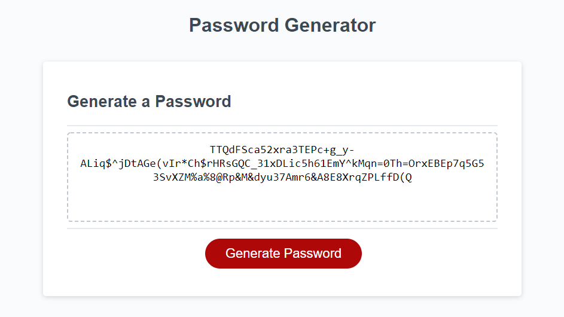

# JavaScript: Password Generator

Javascript-based password generator utilizing user-selected criteria with dynamic HTML and CSS

# Live Example

**Follow** [this link](https://helovedus1st.github.io/password-generator/) **to interact with the live application**

# Objectives

- Create an application that enables employees to create passwords with greater security
- Allow user-determined password length of between 8-128 characters
- Allow users to choose from 1-4 different character types to include: lowercase, uppercase, numerical, and special characters
- Application must be resilient against invalid input entry
- Created password must include all user-selected criteria

# Screenshot
